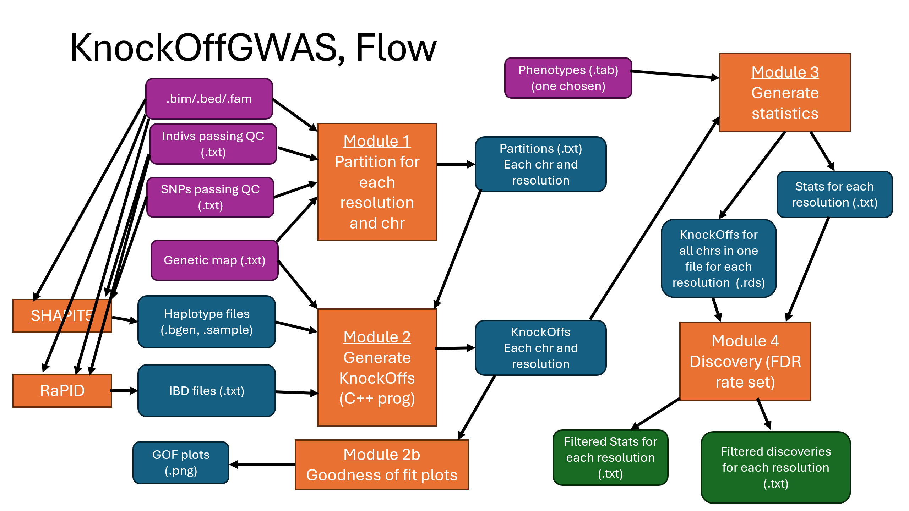

.. _overview:

Overview
========

The KnockOffGWAS pipeline was constructed by adapting the `example <https://msesia.github.io/knockoffgwas/tutorial.html>`_ given by the author(s) of KnockOffGWAS. This example provided all the necessary files to perform KnockOffGWAS for this example but was not suitable for general use. The following list is a description of the new pipeline: 

- The new pipeline is entirely contained within the directory *new_knockoffgwas_pipeline*.
- The scripts have been updated to include parameters for the name of data files rather than be hard-coded with filenames.
- There are many data files (such as IBD files) that are required before the KnockOffGWAS analysis can be ran. Therefore there have been many scripts and programs added to the pipeline to perform this required data preparation.
- The new parts to this pipeline are stored in the *new_bits* directory.
- In principle, one should be able to run the scripts *run_pre_knockoff_gwas.sh* and *run_knockoff_gwas.sh* in order to perform KnockOffGWAS. This can then be followed by running *run_remove_temporary_files.sh* to delete temporary files and by running the Shiny-R app *app.R* in the visualisation directory to analyse the results.
- The analysis is computationally intensive for real datasets and will need to be ran on an HPC machine. With this in mind, this webpage describes the process of performing the analysis of a real dataset on an HPC machine.

The following is the structure and contents of the *new_knockoffgwas_pipeline* directory:

.. code-block:: none

    new_knockoffgwas_pipeline
        ├── knockoffgwas_pipeline
        │   ├── analyze.sh
        │   ├── knockoffgwas
        │   │   ├── module_1_partition.sh
        │   │   ├── module_2b_knockoffs_gof.sh
        │   │   ├── module_2_knockoffs.sh
        │   │   ├── module_3_statistics.sh
        │   │   ├── module_4_discover.sh
        │   │   └── utils
        │   │       ├── check_packages.R
        │   │       ├── filter_stats.R
        │   │       ├── knockoffs_gof.R
        │   │       ├── lasso.R
        │   │       ├── list_original.R
        │   │       ├── make_FBM.R
        │   │       ├── merge_chromosomes.sh
        │   │       └── partition.R
        │   ├── misc
        │   │   ├── download_annotations.sh
        │   │   ├── lmm.sh
        │   │   ├── makedata.sh
        │   │   ├── make_genetic.R
        │   │   ├── make_phenotypes.R
        │   │   ├── spinner.sh
        │   │   └── summarise_lmm.R
        │   ├── new_bits
        │   │   ├── convert_fam_format.R
        │   │   ├── convert_ibd_format3.R
        │   │   ├── convert_ped_file.R
        │   │   ├── convert_sample_format.R
        │   │   ├── filter_ibd_file.R
        │   │   ├── filter_mapping_file.py
        │   │   ├── filter_mapping_file.R
        │   │   ├── interpolate_genetic_map.R
        │   │   ├── interpolate_loci.py
        │   │   ├── interpolate_loci.R
        │   │   ├── make_phenotype_file_from_fam.R
        │   │   ├── make_qc_files.R
        │   │   ├── parameter_estimation.py
        │   │   ├── parameter_estimation.R
        │   │   ├── phase_common_static
        │   │   └── RaPID_v.1.7
        │   ├── snpknock2
        │   │   └── bin
        │   │       └── snpknock2
        │   ├── visualization
        │   │   ├── app.R
        │   │   ├── check_packages.R
        │   │   ├── test_plot.R
        │   │   ├── utils_clumping.R
        │   │   ├── utils_fdp.R
        │   │   ├── utils_manhattan.R
        │   │   ├── utils_plotting.R
        │   │   ├── utils_shiny.R
        │   │   └── www
        │   │       └── theme.css
        │   └── visualize.sh
        ├── run_knockoff_gwas.sh
        ├── run_pre_knockoff_gwas.sh
        └── run_remove_temporary_files.sh

Below is a flow diagram of the KnockOffGWAS pipeline. **This will be updated with a better diagram**

.. _flow-fig:

   Flow diagram of the KnockOfGWAS pipeline.

