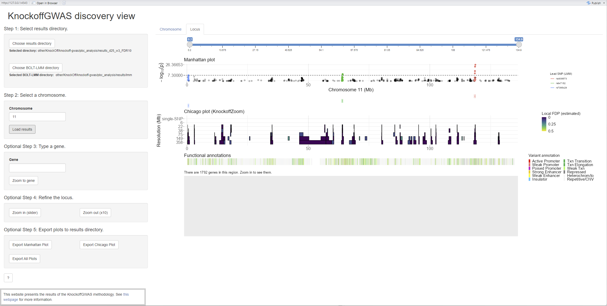
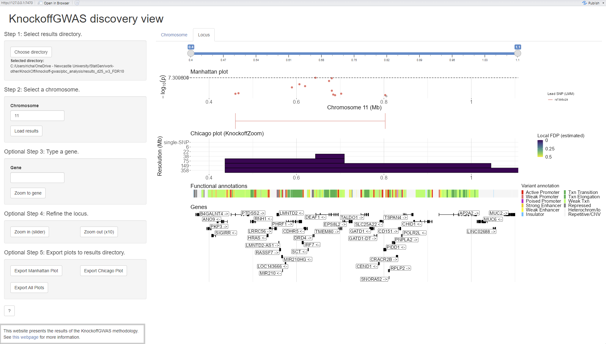

.. _visualisation:

Step 4. Visualisation
=====================

As well as the pipeline there is a shiny R app included, which is at this location: `new_knockoffgwas_pipeline/knockoffgwas_pipeline/visualization/app.R`. This Shiny R app has been updated from the code given by Sesia et al. :cite:`sesia:etal:2021` in their example. 

The easiest way to run the app is to open the `app.R` file in RStudio :cite:`rstudio2025` and click the green button, `Run App`, in the top right of the console.

Follow steps 1. and 2. to the right to choose the directories where the results that you wish to load are stored, and then the chromosome data that you wish to load.

.. _shiny-app1-fig:

   Shiny app of KnockOffGWAS results on chromosome 11.

Plots may be exported using the buttons in step 5. The filenames for these plots will be timestamped and stored in the selected results directory.

.. _shiny-app2-fig:

   Shiny app of KnockOffGWAS zoomed in results on chromosome 11.
